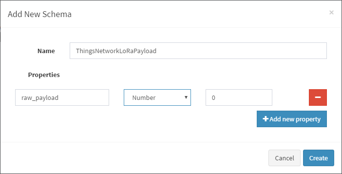
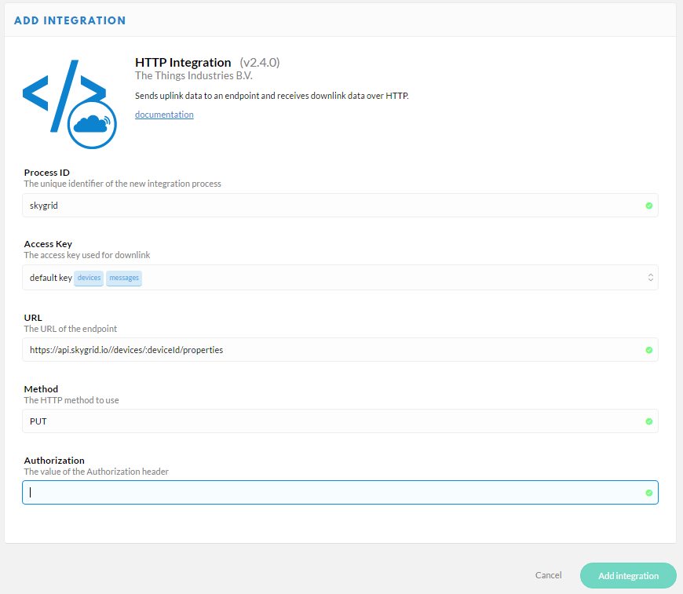

Connecting devices to the Things Network, via the LoRaWAN protocol
__________________________________________________________________

LoRaWAN™ is a Low Power Wide Area Network (LPWAN) specification intended for wireless battery operated Things in a regional, national or global network. LoRaWAN targets key requirements of Internet of Things such as secure bi-directional communication, mobility and localization services. The LoRa specfication came from a collaboration between over 15 large technology companies who created the LoRa_ Alliance organisation to promote LoRa technology and encourage it's adoption (all the member companies sell some piece of the LoRa ecosystem).

Perhaps the most exciting thing about LoRaWAN is that it is possible to buy a standalone gateway and set up a private LPWAN network. Companies deploying LoRa claim it has a 2.5km radius_. It is possible to "daisy-chain" LoRa gateways together, although that is outside the scope of this guide. All over the world there are farmers, warehouses and field-service engineers (and many more) deploying private LoRa networks to improve their business operations. .._Get in touch: www.skygrid.io to discuss your potential application.

The largest public network which utilizes LoRaWAN is the Things network. It is completely community driven - startups, companies and enthusiasts have voluntarily purchased and set up gateways around the world to try and bootstrap a completely free-to-access IoT network. Locations of gateways for specific countried are available - for example Australia_ has 21 active gateways in the Things Network as of April 2017. There is a range of devices currently available around the world for LoRaWAN. Some regions are behind others, especially across different ITU_ regions.

In this guide we shall connect a device to the Things network, which is completely free for anyone to access - it has a growing community of techno-buffs, enthusiasts, volunteers, first-timers and early adopters. There is likely a Things Network community near you already, if not you can start one! The crowdsourced nature of the things network is at the heart of what they do. This is their mission statement:

*The Internet was created by people that connected their networks to allow traffic from, to and over their servers and cables to pass for free. As a result, there was abundant data communication and exponential innovation.*

*The Things Network is doing the same for the Internet of Things by creating abundant data connectivity. So applications and businesses can flourish.*

=====================
Hardware requirements
=====================

The module that we use in this tutorial is the MultiTech mDot_. This module can be deployed without any additional hardware required. A tutorial on how to program the mDot is available here_. The mDot can also be interfaced to other modules, such as the RaspBerry Pi3_. Our experience with using the things network at hackathons led us to develop a raspberry pi compatible 'hat' that provided a simple way to connect these two modules. It also features an integrated Analog to Digital converter, giving the Raspberry Pi 8 ADC interfaces.

Python libraries for interfacing with the mDot can be found in this SkyGrid github_ repo.

 Please check out our affiliate vendors to aquire LoRaWAN modules or gateways in the Australia/NZ region: 

- geowan_
- meshed_

========================================
How the Things network integration works
========================================

Devices push data to their local Things network LoRaWAN gate, using the LoRa radio protocol. At the gateway, the message is sent via normal internet back to the Things network server. The server then further pushes the message to SkyGrid. The complete set up requires some simple configurations.

1 Register the device with the Things network
---------------------------------------------

The best reference for connecting an mDot module to the Things network is their documentation_.

2 Add a new schema in SkyGrid
-----------------------------

The Things network passes a JSON object which contains not only the data payload from the device, but a lot of metadata about the current configuration of the Things network. To accept this data we must register a device in SkyGrid with this Schema.

Below is an example JSON payload received from the Things network.

.. code

	{
	  "app_id": "my-app-id",              // Same as in the topic
	  "dev_id": "my-dev-id",              // Same as in the topic
	  "hardware_serial": "0102030405060708", // In case of LoRaWAN: the DevEUI
	  "port": 1,                          // LoRaWAN FPort
	  "counter": 2,                       // LoRaWAN frame counter
	  "is_retry": false,                  // Is set to true if this message is a retry (you could also detect this from the counter)
	  "confirmed": false,                 // Is set to true if this message was a confirmed message
	  "payload_raw": "AQIDBA==",          // Base64 encoded payload: [0x01, 0x02, 0x03, 0x04]
	  "payload_fields": {},               // Object containing the results from the payload functions - left out when empty
	  "metadata": {
	    "time": "1970-01-01T00:00:00Z",   // Time when the server received the message
	    "frequency": 868.1,               // Frequency at which the message was sent
	    "modulation": "LORA",             // Modulation that was used - LORA or FSK
	    "data_rate": "SF7BW125",          // Data rate that was used - if LORA modulation
	    "bit_rate": 50000,                // Bit rate that was used - if FSK modulation
	    "coding_rate": "4/5",             // Coding rate that was used
	    "gateways": [
	      {
	        "gtw_id": "ttn-herengracht-ams", // EUI of the gateway
	        "timestamp": 12345,              // Timestamp when the gateway received the message
	        "time": "1970-01-01T00:00:00Z",  // Time when the gateway received the message - left out when gateway does not have synchronized time
	        "channel": 0,                    // Channel where the gateway received the message
	        "rssi": -25,                     // Signal strength of the received message
	        "snr": 5,                        // Signal to noise ratio of the received message
	        "rf_chain": 0,                   // RF chain where the gateway received the message
	        "latitude": 52.1234,             // Latitude of the gateway reported in its status updates
	        "longitude": 6.1234,             // Longitude of the gateway
	        "altitude": 6                    // Altitude of the gateway
	      },
	      //...more if received by more gateways...
	    ],
	    "latitude": 52.2345,              // Latitude of the device
	    "longitude": 6.2345,              // Longitude of the device
	    "altitude": 2                     // Altitude of the device
	  },
	  "downlink_url": "https://integrations.thethingsnetwork.org/ttn/api/v2/down/my-app-id/my-process-id?key=ttn-account-v2.secret"
	}

First create a new schema in SkyGrid, and choose which of the above properties are of interest. To receive just the payload, only a single property schema is required

3 Create a Sigfox device in SkyGrid
-----------------------------------

Instantiate the SkyGrid device which is the virtual representation of your real-world hardware.

.. image:: images/ttn_dev.png

4 Construct the callback URL from the deviceId
----------------------------------------------

The REST_ 'API documentation'__ demonstrates how to use the SkyGrid REST interface.

.. code

	https://api.skygrid.io//devices/:deviceId/properties

Replace deviceId in the above URL with the device ID of the object you created in SkyGrid.

5 Configure the callback in the Things network backend
------------------------------------------------------

Inside the Things network console_ click applications. Navigate to the 'integrations' menu. Select 'add integration' and then choose 'HTTP Integration'. Configure the HTTP integration as peer the following parameters:

.. _Lora: https://www.lora-alliance.org/
.. _radius: https://www.iothub.com.au/news/meshed-brings-lorawan-to-brisbane-440136
.. _Australia: https://www.thethingsnetwork.org/country/australia/
.. _ITU: https://www.wikiwand.com/en/ITU_Region
.. _mDot: http://www.multitech.com/brands/multiconnect-mdot
.. _here: https://www.thethingsnetwork.org/labs/story/getting-started-with-the-multitech-mdot
.. _Pi3: https://www.raspberrypi.org/products/raspberry-pi-3-model-b/
.. _github: https://github.com/skygridio/sigfox-python
.. _geowan: https://geowan.io
.. _meshed: http://meshed.com.au/community-iot-networks/: http://meshed.com.au/community-iot-networks/
.. _documentation: https://www.thethingsnetwork.org/docs/devices/
.. _REST: http://docs.skygrid.io/rest/ 
.. _console: https://console.thethingsnetwork.org